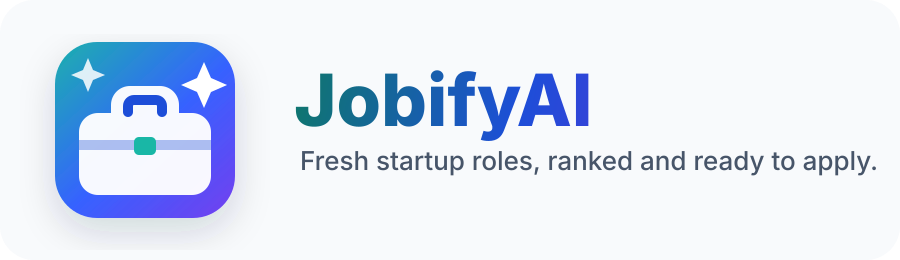
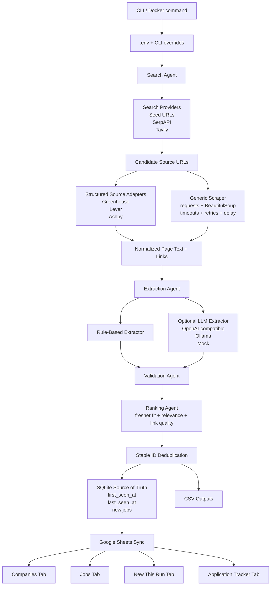

<p align="center">
  
</p>

# JobifyAI

`JobifyAI` is a practical AI-assisted job discovery pipeline for finding startup software and AI/ML roles that are realistic for freshers, interns, new grads, junior engineers, and early-career developers.

The project searches public sources, prefers structured public ATS APIs when possible, scrapes politely when needed, extracts and validates software/AI roles, deduplicates results with stable IDs, stores incremental state in SQLite, writes CSV files, and can sync results to Google Sheets.

The default mode is free and local:

```text
SEARCH_PROVIDER=seed
LLM_PROVIDER=mock
DRY_RUN=true
```

That mode works without SerpAPI, Tavily, OpenAI, Ollama, or Google Sheets.

## Architecture



## Project Structure

```text
JobifyAI/
  main.py
  config.py
  Dockerfile
  docker-compose.yml
  agents/
  services/
    database.py
    google_sheets.py
    source_adapters.py
    scraper.py
    web_search.py
    llm.py
  models/
  utils/
  tests/
  data/
```

## Local Installation

Use Python 3.11 or newer.

```bash
cd /Users/neo/Documents/AppDev/AIJob/startup-hiring-agent
python3.13 -m venv .venv
source .venv/bin/activate
python -m pip install --upgrade pip
pip install -r requirements.txt
cp .env.example .env
```

If your machine has a normal `python3` that is 3.11+, this also works:

```bash
python3 -m venv .venv
```

## Environment Variables

Edit `.env`:

```bash
SERPAPI_API_KEY=
TAVILY_API_KEY=
OPENAI_API_KEY=
OPENAI_BASE_URL=
OPENAI_MODEL=
OLLAMA_BASE_URL=http://localhost:11434
OLLAMA_MODEL=llama3.1
GOOGLE_SHEETS_CREDENTIALS_FILE=service_account.json
GOOGLE_SHEET_NAME=Startup Hiring Agent Results
SEARCH_PROVIDER=seed
LLM_PROVIDER=mock
DATABASE_PATH=data/startup_hiring_agent.sqlite3
MAX_COMPANIES=50
MAX_JOBS_PER_COMPANY=10
DRY_RUN=true
```

## Run Locally

Dry run:

```bash
source .venv/bin/activate
python main.py --dry-run
```

Use sample seed URLs only:

```bash
python main.py --dry-run \
  --replace-seed-urls \
  --seed-url sample://aurora-ai-careers \
  --seed-url sample://forgebase-jobs
```

Use a public ATS board:

```bash
python main.py --provider seed --dry-run \
  --replace-seed-urls \
  --seed-url https://jobs.lever.co/example-company
```

Write to Google Sheets:

```bash
python main.py --max-companies 50 --max-jobs 10 --write-sheets
```

Use a custom SQLite database:

```bash
python main.py --dry-run --database-path data/my_job_search.sqlite3
```

## Run with Docker

Build the image:

```bash
docker build -t jobifyai .
```

Run dry mode:

```bash
docker run --rm \
  --env-file .env \
  -v "$PWD/data:/app/data" \
  jobifyai
```

Run with custom CLI args:

```bash
docker run --rm \
  --env-file .env \
  -v "$PWD/data:/app/data" \
  jobifyai \
  python main.py --dry-run --provider seed
```

Run with Google Sheets credentials:

```bash
docker run --rm \
  --env-file .env \
  -v "$PWD/data:/app/data" \
  -v "$PWD/service_account.json:/app/service_account.json:ro" \
  jobifyai \
  python main.py --write-sheets
```

## Run with Docker Compose

Dry run:

```bash
docker compose up --build jobifyai
```

Google Sheets write mode:

```bash
docker compose --profile write up --build jobifyai-write
```

Run Ollama locally through Compose:

```bash
docker compose --profile ollama up -d ollama
docker exec -it jobifyai-ollama-1 ollama pull llama3.1
```

Then set:

```bash
LLM_PROVIDER=ollama
OLLAMA_BASE_URL=http://ollama:11434
```

And run:

```bash
docker compose up --build jobifyai
```

## Google Sheets Setup

1. Open Google Cloud Console.
2. Create or select a project.
3. Enable Google Sheets API.
4. Enable Google Drive API.
5. Create a service account.
6. Create a JSON key for that service account.
7. Save it in the project as `service_account.json`.
8. Set this in `.env`:

```bash
GOOGLE_SHEETS_CREDENTIALS_FILE=service_account.json
GOOGLE_SHEET_NAME=Startup Hiring Agent Results
```

9. Copy the service account email from the JSON field `client_email`.
10. Create or open the Google Sheet.
11. Share the Sheet with the service account email as Editor.
12. Run:

```bash
python main.py --write-sheets
```

The agent creates or updates these tabs:

- `Companies`
- `Jobs`
- `New This Run`
- `Application Tracker`

## Search Providers

Seed mode:

```bash
python main.py --provider seed --dry-run
```

SerpAPI:

```bash
SERPAPI_API_KEY=your_key
python main.py --provider serpapi --dry-run
```

Tavily:

```bash
TAVILY_API_KEY=your_key
python main.py --provider tavily --dry-run
```

Free tiers are limited, so keep `MAX_COMPANIES` modest.

## LLM Providers

Mock mode:

```bash
python main.py --llm-provider mock --dry-run
```

Ollama:

```bash
ollama pull llama3.1
python main.py --llm-provider ollama --dry-run
```

OpenAI-compatible API:

```bash
OPENAI_API_KEY=your_key
OPENAI_BASE_URL=https://api.openai.com/v1
OPENAI_MODEL=gpt-4o-mini
python main.py --llm-provider openai --dry-run
```

LLMs are used as an optional extraction helper. The rule-based extractor and validation still run so the app remains useful without paid model calls.

## Outputs

Local files:

- `data/output_companies.csv`
- `data/output_jobs.csv`
- `data/output_new_jobs.csv`
- `data/startup_hiring_agent.sqlite3`

Google Sheets:

- `Companies`: company-level records.
- `Jobs`: all current discovered jobs.
- `New This Run`: jobs first seen in the current run.
- `Application Tracker`: append-only tracker for review, applied status, resume version, referral contact, notes, and next action.

## How Freshness Works

Each job receives a stable `job_id` from:

```text
company_id + normalized role title + application/job URL
```

SQLite stores:

- `first_seen_at`
- `last_seen_at`
- `status`

On repeat runs, existing jobs are updated instead of duplicated. Only jobs not already present in SQLite appear in `New This Run` and get appended to `Application Tracker`.

## Fresher-Friendly Detection

Positive signals:

- intern
- internship
- new grad
- university graduate
- graduate software engineer
- entry level
- junior
- associate software engineer
- early career
- 0-1 years
- 0-2 years
- no prior experience
- fresh graduate
- fresher

Negative signals:

- senior
- staff
- principal
- lead
- manager
- architect
- 5+ years
- 7+ years
- 10+ years

Mixed cases are scored and explained in `notes`.

## Testing

```bash
source .venv/bin/activate
pytest
```

Docker test run:

```bash
docker build -t jobifyai .
docker run --rm jobifyai python -m pytest -q
```

## Ethical Scraping Notes

Use this for public career pages, public ATS boards, and public search results. Do not bypass login walls, scrape private pages, evade rate limits, or ignore website terms. The scraper uses a clear User-Agent, timeouts, retries, and request delays.

## Practical Workflow

1. Start with curated seed URLs for startups you care about.
2. Add SerpAPI or Tavily when you need broader discovery.
3. Run daily or weekly.
4. Review `New This Run`.
5. Use `Application Tracker` to manage applying, referrals, resume versions, and follow-ups.
6. Keep SQLite and CSV outputs committed only if they do not contain private data.

## Limitations

- Some job boards render jobs with JavaScript and may need a future Playwright adapter.
- Wellfound and LinkedIn may restrict scraping; use public search snippets or official public pages only.
- LLM extraction can help recall but should not be treated as ground truth.
- ATS adapter coverage currently focuses on Greenhouse, Lever, and Ashby.

## Future Improvements

- Add Workable and YC-specific structured adapters.
- Mark jobs expired when they disappear across multiple runs.
- Add email, Slack, or Discord notifications for new high-fit roles.
- Add a small web dashboard on top of SQLite.
- Add region, visa, and sponsorship filters.
- Add resume-match scoring against a user profile.
